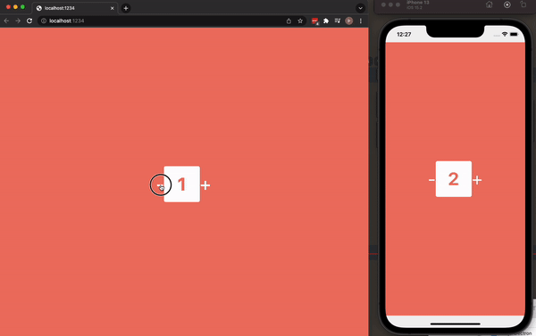

# Javascript/React - Beyond the browser

## Exploration

I did a few little project to test the options out.

- [Electron with regular html/js](/htmljs-electron/)
- [React + Electron](/react-electron/)
- [React native](/reactnative/)

### Electron

I have done a project in React native / expo when we did the [Fræ app](https://github.com/thorbergurharaldsson/m4grp) for the group project in module 4, so I wanted to try Electron, I read up on Electron and apperently if used wrong it can be very bad perfomance-wise, Electron apps can also be really resource heavy, needing alot of ram, some examples of that are Microsoft Teams and VS Code when working on many projects at the same time.
Microsoft Teams can be really slow and according to my research it's because Teams is developed in a way that stalls the main script which is a bad practice when using Electron since the whole application is unusable while stalled.
Slack and Discord on the other hand are examples of really well executed Electron app that are not to resource demanding and are quite fast.

### React native

As metioned before I have used React native in the past but I have never used it to create a web application, I've only used it with Expo to create a mobile application. For that reson I wanted to try to make an app that works both on mobile and web with the same components. That turned out to be easier then I thought and I will definetly use it in future projects!

## Crossplatform app

Since I have only created a mobile app with react native + expo I thought it would be fun to try to create a project that works as a web application and mobile app using the same components. I watch a [video](https://youtu.be/2wOvhDtqsW8) on this matter, in the video she uses a symlink to have the components shared, that wasn't working for me so I ended up copy-pasting the component into the web project. Altough for future project I would like to have the symlink to have a single source of truth for the components. This app could for sure also be deployed as a desktop app using electron, that could be a cool addition!

Here is the app in action:

## Conclusion

I really like Electron for it's simplicity, you can have any web app running as a desktop app in a very short time.

React Native is really nice to use since you don't really have to think about styling native components, and being able to use the same components across platforms is really nice!
